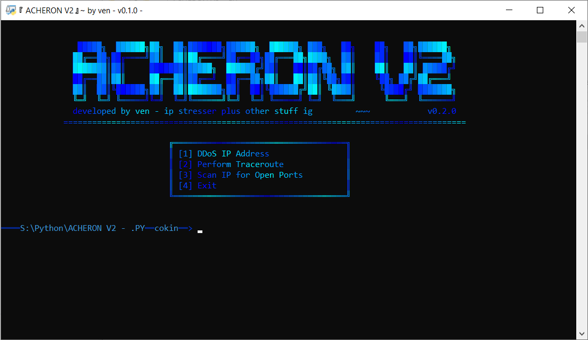

# ===Acheron V2===
Acheron V2 is a better version of the original project 'ACHERON' (not uploaded to github) that contains more features and a much cleaner UI! It is developed by ***Venom*** of ***Lunar Team***.

# ===Preview===


# ===Features===
- IP Address DDoSing
- Performing Traceroutes
- IP Port Scanning

# ===Licences & Terms of Use===
This project is licensed under the GNU General Public License v3.0
```js
Acheron V2 is made solely for educational purposes and is not created for malicious purposes.
Any damage done with this software is not at the fault of Venom or at the fault of Lunar Team.
It is only at fault of the user.
```
